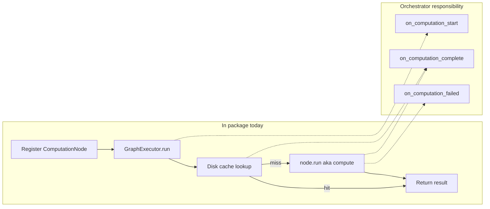

# Computations

**Computations** are analysis steps that consume data from one or more sessions or streams and produce artifacts: time-resolved series, summaries, in-memory Python structures, and optionally dedicated views. The lists below describe what a computation may **access** as inputs and what it may **provide** as outputs. Orchestration (dependency graphs, caching, timeline integration) may live in notebooks or other packages; this document states the intended contract.

## Computations can access

1. **One or more datastreams or datasources** — For example, an EEG datasource attached to a session, or other modality streams needed for the analysis.

2. **A preceding required computation** — When a step depends on another step’s outputs, it declares that prerequisite (a dependency in a directed acyclic graph of computations).

3. **A computation cache** — A layer that stores prior results and reuses them when nothing material has changed, so rerunning a script or notebook on the same sessions does not repeat heavy work from scratch.

## Computations can provide

1. **A new datastream or datasource** — One or more values that are continuous or sampled in time, aligned with a timeline, plus metadata describing how they were produced (for example, a time-binned spectrogram from a subset of EEG channels over a chosen frequency range and analysis parameters).

2. **A new summary or aggregate statistic** — Session- or cohort-level scalars or small tables (for example, the average number of `HIGH_ACCEL` events in a session, or a session-averaged theta/delta power ratio restricted to frontal channels).

3. **Raw Python result objects** — Arbitrary structures (arrays, dicts, domain models) intended for downstream computations or for manual export to disk via your own serialization path.

4. **(Optional) A custom visualization or renderer** — A view that presents part of the output in context (for example, an EEG track that displays the spectrogram corresponding to a specific spectrogram computation).

## Computation authoring protocol

This section is the normative scaffold for **new** computations: how to name responsibilities, what to return, and how that lines up with the DAG types in this package.

### Authoring scaffold (normative)

- **Metadata** — Every computation registered in a graph has a stable `id`, a version string (treat as semver-ish for cache invalidation), `deps` (prerequisite node ids), a primary [`ArtifactKind`](computations/protocol.py) (`stream`, `summary`, `object`, `renderer`), and stable parameter hashing via `params_fingerprint` or the default JSON-sorted digest on [`ComputationNode`](computations/protocol.py).

- **`compute` (semantic name)** — The core analysis step. In code it is the callable stored as **`run`** on [`ComputationNode`](computations/protocol.py): `(ctx: RunContext, params: Mapping[str, Any], dep_outputs: Mapping[str, Any]) -> Any`. Use the name `compute` in docs and module structure; wire it as `run=...` when registering.

- **Structured outputs (recommended)** — Prefer a small dict or dataclass with explicit keys (time axis, arrays, provenance metadata) for `stream` and `summary` kinds rather than opaque blobs, so downstream steps and caches stay understandable. Legacy nodes may return arbitrary objects until refactored.

- **`build_output_renders` (optional)** — A separate step that turns a **cache-safe** result into timeline- or UI-specific constructs (datasources, figures, HTML fragments). It is **not** invoked by [`GraphExecutor`](computations/engine.py); call it from notebooks, timeline builders, or adapters so analysis code stays independent of rendering.

### Lifecycle and signals (contract for orchestrators)

Orchestrators (notebooks, apps, or a future executor wrapper) can expose a consistent event surface so progress and UI updates stay predictable:

- **`on_computation_start(node_id, ctx, params)`** — Before the node’s work begins (conventionally after a cache miss is decided, if the orchestrator distinguishes cache hits).

- **`on_computation_complete(node_id, result, cache_key_or_none, meta)`** — After a successful `run`.

- **`on_computation_failed(node_id, exc)`** — On failure (optionally with partial state if the orchestrator tracks it).

- **`on_cache_hit(node_id, result)`** *(optional)* — Alternatively, treat cache hits like completion with a flag in `meta` instead of a separate signal.

**Implemented today:** [`GraphExecutor`](computations/engine.py) runs the DAG synchronously and calls `node.run` only; it does **not** emit these events. Layers above the executor should fire them when wrapping `GraphExecutor.run` or [`run_eeg_computations_graph`](computations/eeg_registry.py), or the engine can be extended later to accept callbacks.

Solid edges are what `GraphExecutor` does; dashed edges are optional hooks the orchestrator may implement.

### Checklist for a new computation

1. Implement the **`compute`** logic (pure analysis; same signature as `run` above, or delegate from a thin `run` wrapper).
2. Choose the primary **`ArtifactKind`** and document which outputs are streams vs summaries vs opaque objects.
3. Register a [`ComputationNode`](computations/protocol.py) with **`run=...`**, `deps`, `version`, and custom **`params_fingerprint`** if JSON default is unstable.
4. Document public parameters and defaults (README or module docstring).
5. Optionally add **`build_output_renders`** in a consumer package (e.g. timeline) that maps results to views.
6. Optionally wire **`on_computation_*`** in your orchestration layer.

### Code references

- [`computations/protocol.py`](computations/protocol.py) — `PROTOCOL_VERSION`, `ArtifactKind`, `RunContext`, `SessionFingerprint`, `ComputationNode`, `ComputationRegistry`.
- [`computations/engine.py`](computations/engine.py) — `GraphExecutor`, topological execution, merge of global and per-node params.
- [`computations/cache.py`](computations/cache.py) — Disk cache and chained cache keys.
- [`computations/eeg_registry.py`](computations/eeg_registry.py) — Example registered EEG nodes and `run_eeg_computations_graph`.

## Implementations in this package

PhoPyMNEHelper currently hosts concrete analysis helpers rather than a full orchestration engine. Useful entry points:

- [`EEGComputations`](../EEG_data.py) — Batch-oriented helpers on `mne.io.Raw` (e.g. spectrogram, continuous wavelet transform, topo-style pipelines).
- [`analysis/computations/`](computations/) — DAG protocol, cache, executor, and modules (for example, fatigue-related metrics in `fatigue_analysis.py`, theta/delta sleep-intrusion style pipelines in `computations/specific/ADHD_sleep_intrusions.py`, and continuous EEG spectrogram defaults for timeline use in `computations/specific/EEG_Spectograms.py`).

Caching, explicit dependency declarations between computations, and custom renderers are not defined solely in this folder; they are part of the broader contract above.
